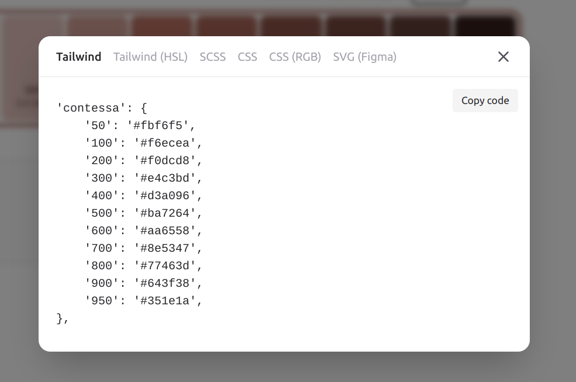

# {{ $frontmatter.title }}

The application UI is split into UI components. They are built as `macro`s and `fragment`s, offered by the default server side template engine Nunjucks. All components use Tailwind CSS styling. We aimed to deliver an easy to read and understand architecture, with less than the usual amount of abstractions, but also to offer a good basis of component driven architecture.

::: warning Important
Don't get confused. Apostrophe core offers a custom Nunjucks tag - [Async component](https://v3.docs.apostrophecms.org/guide/async-components.html#using-async-components-in-templates). This is not what we are referring to. UI Component in the current context is an abstract unit, used to build the application UI. For example, this is the primary button UI component delivered via Nunjucks `macro`.
```njk
{# modules/theme/views/button.html #}

  ...

```
And here is the product card - a Nunjucks `fragment`:
```njk
{# modules/theme/views/card.html #}

  ...

```
And we use those as UI components:
```njk



{{ buttons.primary('My button') }}

```
Throughout this documentation, when we are saying "component" we do mean "UI Component" as explained above. [Learn more about Nunjucks templates](https://v3.docs.apostrophecms.org/guide/fragments.html)
:::

::: tip
We've put a lot of efforts in documenting our code. Every template contains useful information. There is a good chance to find answers of your questions that are not to be found in the documentation in a developer code comment.
:::

## Branding

### Logo and `favicon.ico`

The logo and `favicon.ico` are dynamic and can be controlled via the Global configuration. You can opt out from this behavior and implement static logo and/or `favicon.ico`:
- Remove `favicon` and `logo` fields from the schema to `modules/@apostrophecms/global/index.js`
- Replace `modules/theme/public/logo.svg` or your own, e.g. `modules/theme/public/logo.png`
- Adapt the `width` and `height` variables in `modules/theme/views/logo.html`. Keep in mind, those are only needed for aspect ratio (calculated by the browser). Responsive size restrictions are applied in the header and footer fragments. 
- If you have added logo file, update the path in `modules/theme/views/logo.html`, for example ``
- Add `modules/theme/public/favicon.ico`, open `views/layout.html` and modify
```njk

   // [!code --]
  <link rel="icon" href="{{ data.global.favicon._url }}" /> // [!code --]
  <link rel="icon" href="{{ apos.asset.url('/modules/theme/favicon.ico') }}" /> // [!code ++]
   // [!code --]

```

### Color scheme

The theme uses a `brand` color palette and provides a number of predefined brand color schemes. You can choose and modify the predefined palette configurations, or introduce new one. Detailed instructions can be found in the [Brand Color Scheme](#brand-color-scheme) section. 


## UI Components 

All components are part of the `theme` modules and can be found in the root of `modules/theme/views` folder. You are free to modify and extend them (add new components). The additional folder `modules/theme/views/design-system` does not contain a code used in the application. It's a part of the design-system used during the development of the project. You can find more information in the [Design System](./design-system.md) section.


The components are the building blocks of the application UI. For example, no matter if you are introducing a widget or directly embedding a "Promo" section in your pages, you are importing the relevant `promo-widget.html` and just passing the expected arguments, the visual result will be always the same. This approach leads to a predictable, consistent and composable UI. The `-widget` suffix is something we don't usually use when naming purely UI components, but it makes sense in the context of this project. It points out that the component is primarily (but not exclusively) used as a widget.

You can modify any existing component or introduce a new one inside `modules/theme/views` and profiting from the benefits of the composition architecture of the application - modifying a chosen component will guarantee that every page using it will be updated with that change. For example, modifying `button.html` so that it fits your project requirements, will guarantee that all the buttons, including those used in another UI components, will be updated.  

## Client side sources

The UI components are organized inside of macros or fragments. There is no need for additional styling files, because they use Tailwind CSS. However, some components do need a client side JavaScript in order to deliver some kind of interactivity. In such cases, components can add their client side sources to `modules/theme/ui/src/components/`. All component client side sources are then bootstrapped in `modules/theme/ui/src/index.js`. This possible because of the offered by Apostrophe [internal build system](https://v3.docs.apostrophecms.org/guide/front-end-assets.html).

## Extending the UI

Let's assume you want to add a new "accordion" feature. Here are the possible implementation steps:
- Add your HTML markup as `modules/theme/views/accordion.html`. It is wise to use a `fragment` in order to render your markup (read further for more information why).
- Add `modules/theme/ui/src/components/accordion.js` for your client side implementation. You can use vanilla JavaScript or third party library to deliver the feature based on the markup produced by `accordion.html`.
- One way to do it is to, e.g. `export { init }` in `accordion.js`. This method should read the DOM, find DOM elements of interest, and apply the desired client side logic. In this case, you also need to import and register your initialization logic:
```js
// modules/theme/ui/src/index.js
import { toggle as mobileNavToggle } from './components/mobile-nav';
import { init as initGalleries } from './components/gallery';
import { init as initTabs } from './components/tabs';
import { init as initAccordion } from './components/accordion'; // [!code ++]

export default () => {
  const theme = window.apos?.modules?.theme || {};

  // Components
  theme.mobileNavToggle = mobileNavToggle;

  // Register
  window.apos.modules.theme = theme;

  // Apostrophe integration - global events
  const onReadyAndRefresh = () => {
    initGallery();
    initTabs();
    initAccordion(); // [!code ++]
  };
  apos.util.onReady(onReadyAndRefresh);
};
```
- We simply import and add our `init` method to `onReadyAndRefresh`, so that Apostrophe can execute it for us on page initialization, or when refreshing the page (when content managers apply a change on that page).
- You can export any number of methods and register them globally. This can be useful if you want to provide widget specific features. For example, we could do `theme.myFeature = myFeature` above. After that, our widgets will be able to call `window.apos.module.theme.myFeature()` inside their `player`. Learn more about client side code for widgets in the [official Apostrophe documentation](https://v3.docs.apostrophecms.org/guide/custom-widgets.html#client-side-javascript-for-widgets).

::: tip
You can use the existing components as a blueprint for your own features. For example, `gallery.js` showcases implementing a client side feature via global initialization, while `mobile-nav.js` shows how to register a global `toggle` method, later used in `header.html` with `onclick` HTML attribute.  
:::

## `macro` vs `fragment`

When to use a `macro` and when a `fragment`? An important question in order to minimize your future refactoring efforts.

Use macro when:
- No `fragment`, `area` or `component` or any other asynchronous tag is expected to be rendered inside of it.
- No `__t()` usage is expected (i18n).
- No "body" (the macro special function `caller()` usage) is expected.

If you fail to evaluate any of the above to `true` - use a `fragment`. If you are in doubt - just use `fragment`.

## Tailwind CSS

Tailwind configuration can be found in the root `tailwind.config.js` file. Refer to the official [Tailwind CSS documentation](https://tailwindcss.com/docs/configuration) for more information about the options you can set.

The only deviation from the standard configuration is a special color `brand` introduced in the application. It's explained [in details below](#brand-color-scheme).

You can modify any Tailwind class used in the application to fit your project needs.

::: warning
A common mistake when working with Tailwind CSS is concatenating classes. The Nunjucks components (and any client side framework) allows dynamic use of classes. This will work well with Tailwind unless you obfuscate the class itself. For example:

```njk:line-numbers {2}
{# GOOD #}


{# BAD - won't work #}
 // [!code error]

<span class="text-sm{{ cls }}{{ more }}">...</span>
```
:::

### Bootstrapping

The Tailwind bootstrap file `modules/theme/ui/src/tailwind.scss` contains 
- The Tailwind recommended setup (core components and utilities)
- `base` layer, taking care of the global typography and adding some Apostrophe specific global styling (like `pager`).
- `components` layer with some additional useful typography classes (`t-display`, `t-subtitle`, `t-caption`, `t-link`, `t-richtext`)

::: info
The theme is using the core Tailwind `@tailwindcss/typography` plugin (`prose` class) to handle dynamic markup, provided by Apostrophe core `@apostrophecms/rich-text-widget`. This is done via the `className` option per instance of the widget. You can control the custom pages rich text behavior with just modifying the `.t-richtext` component in `modules/theme/ui/src/tailwind.scss`. Some widgets are using rich text in a specific context and are providing specific `className` instructions to their owned rich text instances.
:::

### Font

The configured in `tailwind.config.js` font `Inter var` is loaded in `modules/theme/ui/src/fonts.css`. The font itself can be found in `modules/theme/public/fonts`.

### Brand Color Scheme

The starter kit is extending the default Tailwind CSS color scheme and adding named color palette `brand`, while keeping all other shipped core colors intact. The branding is delivered through a combination of the `brand` and the [Tailwind core `gray`](https://tailwindcss.com/docs/customizing-colors) palettes. 

The `brand` palette follows the Tailwind colors standard - named colors ranging from `brand-50` to `brand-950`. Additionally, the configuration introduces a `DEFAULT` value for both `brand` and `gray` palettes, which allows syntax `bg-brand`, `text-gray`, etc. The `brand` and `gray` defaults are respectively `brand-600` and `brand-300`. 

One additional feature offered by the starter kit is a number of predefined brand color palettes and the option to choose a `brand` palette on build time. You can find the existing color palettes in the `colors/` folder. `default.json` (Jelly Bean) is the brand palette used by default, when no preference is specified. 

You can build the application with the desired brand palette in production:
```sh
APP_BRAND=purple npm run build
npm start
```
Or you can start in development:
```sh
APP_BRAND=purple npm run dev
```
::: warning
You can't switch brand palette or choose brand color on runtime. Tailwind CSS is generating and tree-shaking the styles on build time. This won't work as you might expect:
```sh
APP_BRAND=pink npm run build
# The application will still use pink color palette
APP_BRAND=purple npm start
```
:::

You can find a preview of the available brand palettes in the [user guide](../user/index.md#brand-colors) section.

### Add your own brand palette

First you need to translate your desired `brand` palette as Tailwind standard named palette. There is a tool that can help you do that - https://uicolors.app/create. Create your color scheme and while in edit mode, use the "Export" link. 



Convert the "Tailwind" output to a JSON, paste it in a newly created file `colors/mybrand.json`. Add an appropriate `DEFAULT` property (see `colors/default.json` for an example). Now you can build:

```sh
APP_BRAND=mybrand npm run build
```
or directly start in development

```sh
APP_BRAND=mybrand npm run dev
```

::: tip
In order to get good results (contrast) when adding your own `brand` palette, you should ensure a good contrast of the `DEFAULT` brand color with `white`. The `gray` color palette is generally not mixed with the `brand`. If your brand colors requirements can't fulfil the above, you might need to go through all components and adapt them. It's also possible to use the `dark mode` Tailwind feature to produce a dark design (and you can force it as the default and only choice). In this case, you would need to add the dark mode instructions to all components. 
:::

## Icons

An SVG icon sprite is auto generated from `modules/theme/icons` folder. You need to add your own icons SVG and do `npm run build:sprite` or just rebuild the project and the icons will appear as choices in the appropriate schema fields (for example look at the `headerCtaIcon` field in `modules/@apostrophecms/global/index.js`).

You can embed any icon available in the folder above in the site via the `icon.html` macro. 
For example for an icon SVG `modules/theme/icons/heart.svg`, in your templates:

```njk
{# default size, equals to 'md' #}
{{ icon.svg('heart') }}
{# add custom class to control the color 
  or just do it in the parent element #}
{{ icon.svg('heart', cls = "text-brand") }}
{# predefined sizes #}
{{ icon.svg('heart', 'sm') }}
{{ icon.svg('heart', 'md') }}
{{ icon.svg('heart', 'l') }}
{{ icon.svg('heart', 'xl') }}
{# custom size #}
{{ icon.svg('heart', 'h-[96px] w-[96px]') }}
```

The project uses the Outline versions of [Heroicons](https://heroicons.com/) (with the exception of the internally developed social icons). Any icon from this package will work out of the box. The SVG files are automatically optimized. 

You can find the build script in `scripts/make-svg-sprite`.

## Figma source

You can use the community [Figma document](https://www.figma.com/community/file/1250089202074615969), containing the Design System, component library and page prototypes, as your project base.


## Helpers and Utils

The `helpers.html` fragment delivers  `container` and `section` layout helper fragments. They are used to control the horizontal and vertical spacing respectively in the page layouts. 

The `utils.html` contains only the `attrs` macro. It's a useful utility for building HTML attributes from object variables.

You can add more helpers and utilities according to your project needs.
