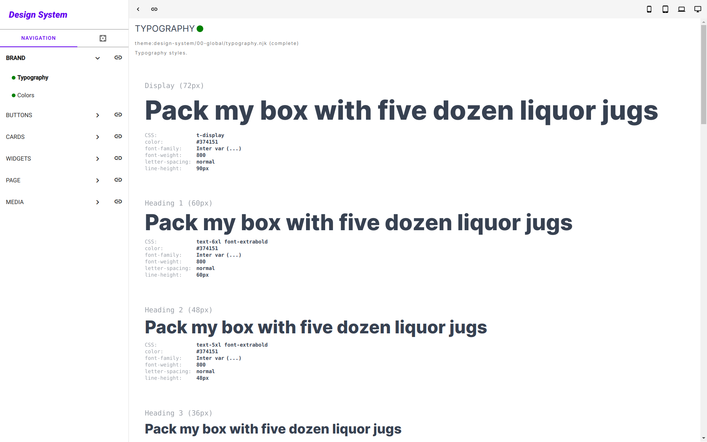
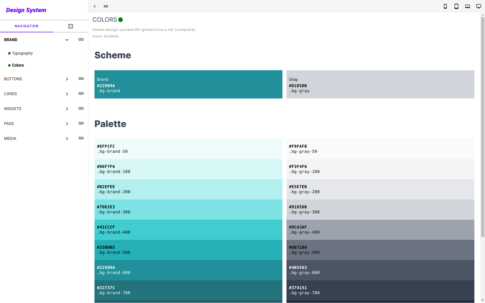
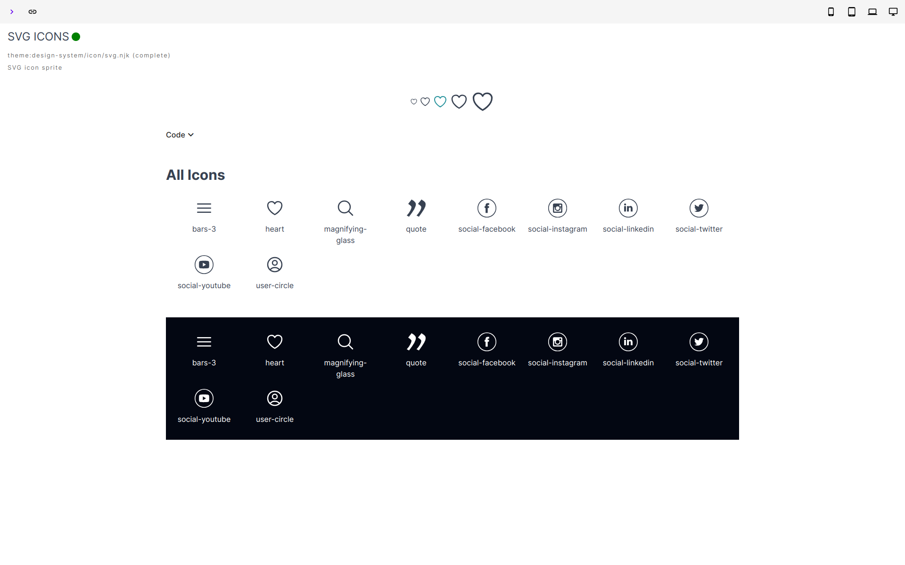
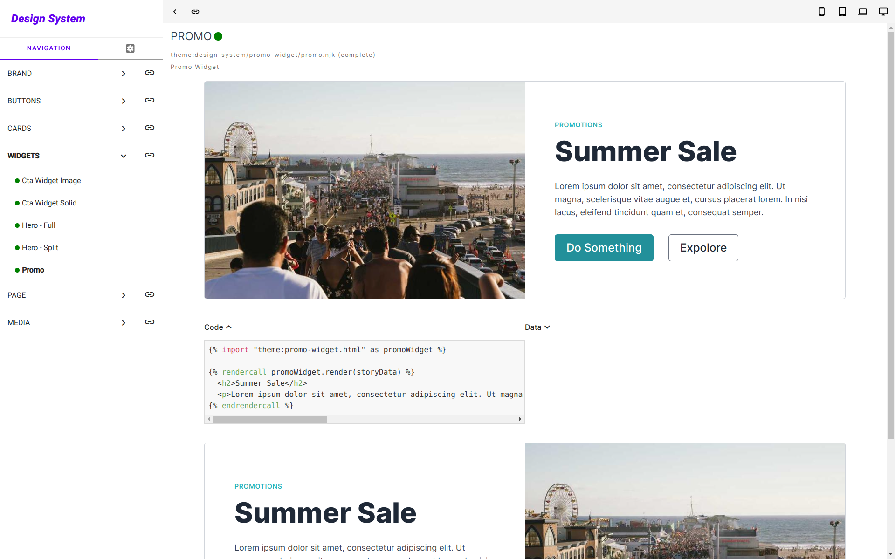
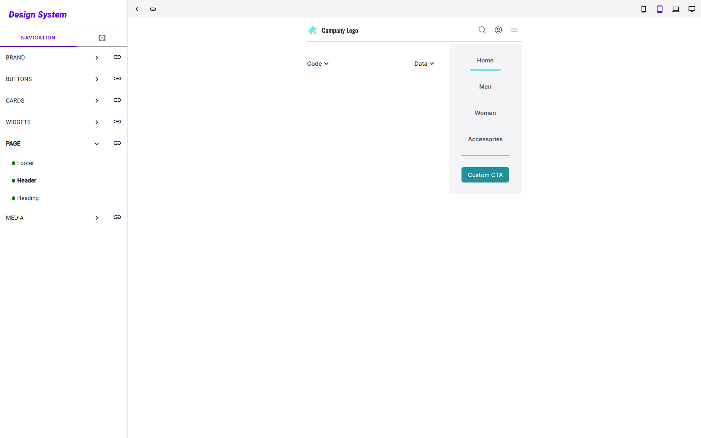

# {{ $frontmatter.title }}

The E-commerce Starter Kit project was built using a 3rd party open source module - Corllete Design System. It is not integrated and installed by default. The module was used in developing the application UI in isolation, according to the [Figma design system rules and prototypes](https://www.figma.com/community/file/1250089202074615969). 

## Installation

1. Install the module

```sh
npm install @corllete/apos-ds
```
2. Uncomment the following section in `app.js`

```js
// ...(process.env.NODE_ENV !== 'production' // [!code --]
//   ? { // [!code --]
//     '@corllete/apos-ds': { // [!code --]
//       options: { // [!code --]
//         modules: [ 'theme' ], // [!code --]
//         // enable this for showing the "Help" navigation group // [!code --]
//         docs: false // [!code --]
//       } // [!code --]
//     }, // [!code --]
//     '@corllete/apos-ds-page-type': { // [!code --]
//       options: { // [!code --]
//         legacyCodeBlocks: false, // [!code --]
//         useReleaseId: false // [!code --]
//       } // [!code --]
//     } // [!code --]
//   } // [!code --]
//   : {} // [!code --]
// ), // [!code --]
...(process.env.NODE_ENV !== 'production' // [!code ++]
  ? { // [!code ++]
    '@corllete/apos-ds': { // [!code ++]
      options: { // [!code ++]
        modules: [ 'theme' ], // [!code ++]
        // enable this for showing the "Help" navigation group
        docs: false // [!code ++]
      } // [!code ++]
    }, // [!code ++]
    '@corllete/apos-ds-page-type': { // [!code ++]
      options: { // [!code ++]
        legacyCodeBlocks: false, // [!code ++]
        useReleaseId: false // [!code ++]
      } // [!code ++]
    } // [!code ++]
  } // [!code ++]
  : {} // [!code ++]
), // [!code ++]
```

3. Move the contents of folder `design-system-setup/` to the `modules/` folder of your project. You should have the following structure:

```sh
modules/
  @corllete/
```

4. Uncomment the following lines in `modules/@apostrophecms/page/index.js`

```js
if (process.env.NODE_ENV !== 'production') {
  // park.push({ // [!code --]
  //   parkedId: 'design-system', // [!code --]
  //   type: '@corllete/apos-ds-page-type', // [!code --]
  //   _defaults: { // [!code --]
  //     slug: '/ds', // [!code --]
  //     title: 'Design System' // [!code --]
  //   } // [!code --]
  // }); // [!code --]
  park.push({ // [!code ++]
    parkedId: 'design-system', // [!code ++]
    type: '@corllete/apos-ds-page-type', // [!code ++]
    _defaults: { // [!code ++]
      slug: '/ds', // [!code ++]
      title: 'Design System' // [!code ++]
    } // [!code ++]
  }); // [!code ++]
}
```

5. In your `package.json`:

```json
{
  "scripts": {
    "start": "NODE_ENV=production node app",
    "predev": "npm run build:ds", // [!code ++]
    "dev": "npm run build:sprite && nodemon",
    "test": "npm run lint && npm run test:unit",
    "test:unit": "mocha",
    "lint": "eslint . --ext .js",
    "build": "NODE_ENV=production npm run build:sprite && NODE_ENV=production node app @apostrophecms/asset:build",
    "build:sprite": "./scripts/make-svg-sprite",
    "build:ds": "node app @corllete/apos-ds-page-type:publish-assets",
    "release": "npm install && npm run build && NODE_ENV=production node app @apostrophecms/migration:migrate"
  },
}
```

::: details
The `build:ds` script will publish the design system assets to the `public/` folder. If you want to have the design system available in e.g. staging evnironment, you have to adapt the code checks above (e.g. `APP_ENV` instead `NODE_ENV`) and ensure that your CI build pipeline offers a default MongoDB connection. The database is not required for anything else than to allow Apostrophe to run the publish assets task. 
:::

6. `npm run dev` and navigate to `/ds` to see the design system in action.

## Usage

All UI components inside `modules/theme/views` have their corresponding "stories" in `modules/theme/views/design-system`. You can use them as a reference when developing your own components. You can refer to the [module documentation](https://github.com/corllete/apos-ds) for more information. The module repository contains a [demo application](https://github.com/corllete/apos-ds/tree/main/packages/app) containing a detailed setup and usage examples.

::: warning Disclaimer
The module is battle tested and used in many large scale projects developed by the Corllete team. However, it is open sourced as it is and may not fit your needs or lack documentation for certain usage aspects. Feel free to contact the maintainers if you have any questions or suggestions.

The module **is NOT officially supported** by Apostrophe CMS.
:::

## Remove / Uninstall

1. Uninstall the module (if previously installed)

```sh
npm uninstall @corllete/apos-ds
```
2. Remove the module reference from `app.js`
3. Remove the `design-system-setup/` or `modules/@corllete/` (if already moved)
4. Remove the parked page reference from `modules/@apostrophecms/page/index.js` 
5. Remove the `build:ds` script and all references to it from `package.json`

## Screenshots

### Typography screen



### Colors screen



### Full screen auto-generated icons sprite



### Component story screen



### Component mobile story screen


