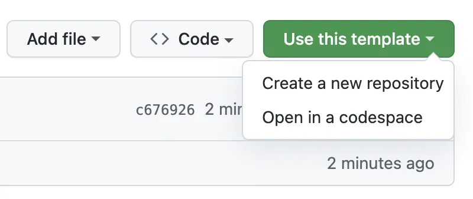
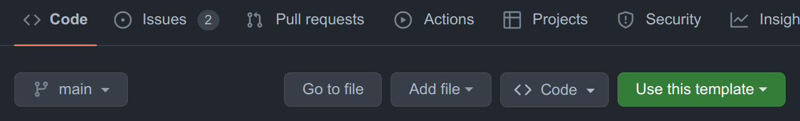

# {{ $frontmatter.title }}

The e-commerce starter application aims to deliver a good starting point of Apostrophe CSM based e-commerce solutions, using the wide variety of features and techiques prvodied by the Apostrophe core. 

## Try it on Codespaces

You can try the starter kit on GitHub Codespaces. On the main page of the `apostrophecms/starter-kit-ecommerce` repository, under the "Template" dropdown, choose "Open in a codespace":



You can find a detailed guide at https://docs.github.com/en/codespaces/getting-started/quickstart using.

::: tip
When codespaces is initialized for a first time, it will take some time to install the dependencies and build the application. You can check the progress in the "Terminal" tab. Once the application is built, you can start the application via `npm run dev`.

You may see an initial screen of the MongoDB extensions. You can safely ignore it and close the tab. No configuration is needed for the application to run.
:::

## Local Installation

::: tip
You will need the proper Node.js environment, a MongoDB up and running, etc. Follow the [official documentation](https://v3.docs.apostrophecms.org/guide/setting-up.html) for more information.
:::

### Method 1

1. If you haven't already, install the [Apostrophe CLI tool](https://v3.docs.apostrophecms.org/guide/setting-up.html#the-apostrophe-cli-tool) using 
   ``` sh
   npm install -g @apostrophecms/cli
   ```
   
2. Clone the project locally by navigating to the parent directory you want the repo installed within and run the command:
   ``` sh
   apos create my-project-name --starter=ecommerce
   ```
3. Change to the new directory and run it:
   ``` sh
   npm run dev
   ```

### Method 2

1. Choose "Use this template" button on the main repository page and create your own repository:



2. Clone it (replace `user/repo-name` as appropriate)
```sh
git clone git@github.com:user/repo-name.git
```

3. Install the dependencies

```sh
npm install
```
Optionally, you can update the core dependencies to the latest versions:
```sh
npm update
```

4. Run it

```sh
npm run dev
```

## Initial configuration

- Change the `shortName` value in your configuration in `app.js` note that installation using the CLI will complete this step automatically.
```js
require('apostrophe')({
  shortName: 'my-project-name',
  // ...rest of the configuration
});
```
- The control for restarting the application on change (dev mode only) has been moved to `modules/theme/index.js` compared to the default `starter-kit-essentials` application (`asset` module). If you want to disable this feature:
```js
// modules/theme/index.js
handlers(self) {
  return {
    '@apostrophecms/page:beforeSend': {
      webpack(req) {
        req.data.isDev = (process.env.NODE_ENV !== 'production'); // [!code --]
        req.data.isDev = false; // [!code ++]
      }
    }
  };
},
```

## Production

You need to build the application and execute the migrations when starting it in production:

```sh
npm run release
npm run start
```

## Architecture

The starter kit is a standard Apostrophe CMS application, built on top of the official [`starter-kit-essentials`](https://github.com/apostrophecms/starter-kit-essentials) template. All the modules (including widgets) can be found in the `modules/` folder. You can learn more about the modules in the [Modules & Widgets](./modules-and-widgets.md) section. 

The entire UI (except the product view page) lives in the `theme` module. The application uses a standard Tailwind CSS configuration. You can learn more in the [Branding & UI](./branding-and-ui.md) section.

We have developed a tool for automated SVG sprites. It's seamlessly integrated and is explained in detail in the [Branding & UI](./branding-and-ui.md) section.


