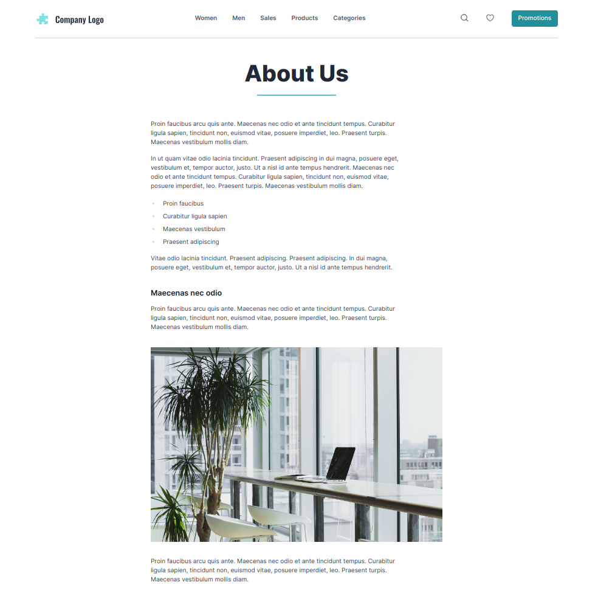
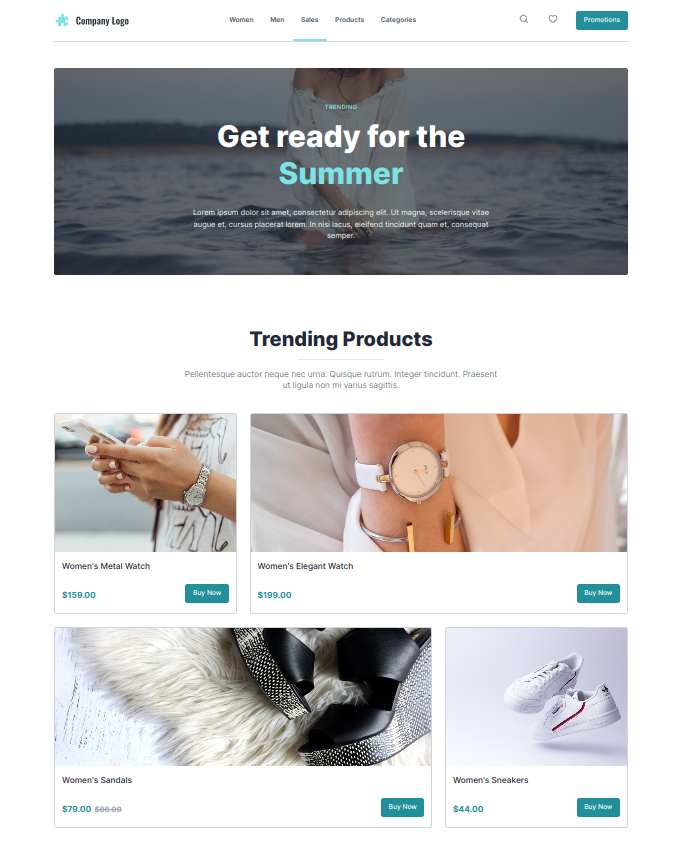

# {{ $frontmatter.title }}

The Apostrophe CMS E-commerce Starter Kit comes with a "Default" page type, that can be chosen for creating Custom Pages. You can create a custom page via the Page Manager (open from "Pages" administration menu item) and the "New Page" button.

## Choose a Header Type

You can choose the heading type of every custom page via the "Header Type" field. By default, a "Title" will be set, resulting in the default Title/Tagline heading. You can choose "Hero" and you'll see a new area for choosing a Hero widget.

## Build Your Page

You can build your page by adding widgets. You can mix and match any of the available widgets to achieve the desired result - being it a generic informational or a landing product page.

### Generic Page

### Landing Product Page

You can learn more about widgets in the [Widgets](./widgets.md) section.
