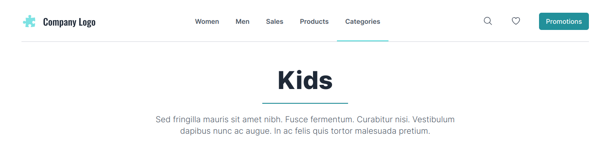
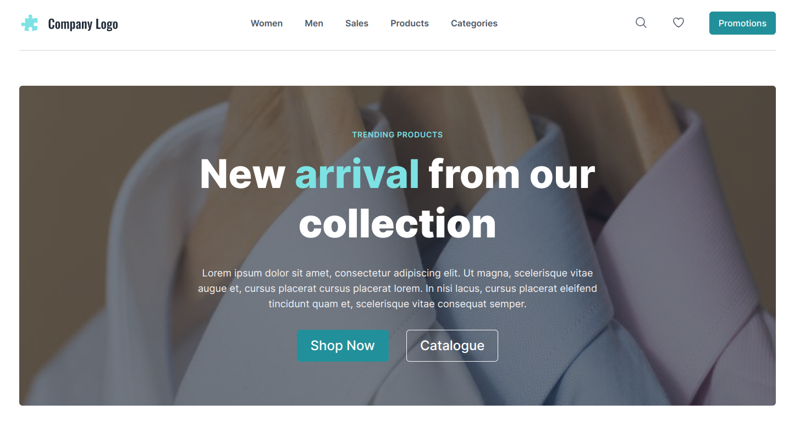
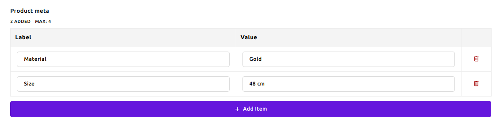

# {{ $frontmatter.title }}

The Apostrophe CMS E-commerce Starter Kit comes with Product and Product Category pieces and pages. Be sure to check out the [Getting Started](./getting-started.md) section first for a list of tips and recommendations as first steps in building your site content, including receipes for content taxonomy.

## Product Category

You can create new categories by either using the quick menu (the blue plus button at the top of the page) and choosing "Product Category", or by using the "New Product Category" button after clicking the "Content - Product Categories" administration menu item.

Beside the essential fields, when adding a new category piece, you can also:

- Add "Publication Date" to control the order of the categories when shown in the page or widget. Categories having newer publication date will be shown first. If you leave that field empty, it will contain the date when the category was created.
- From the "Page" tab, you can control the heading type of every category view page via the "Header Type" field. By default, a "Title" will be set, resulting in the default Title/Tagline heading. You can choose "Hero" and you'll see a new area for adding the Hero widget.

**Title**

**Hero**

::: tip
You can choose your user experience - manage your widgets within the page itself or inside the Page Editor. Keep in mind, that the Heading area will be visible once you choose the "Hero" heading type, which can happen only in the Page Editor.
:::

## Product

You can create new products by either using the quick menu (the blue plus button at the top of the page) and choosing "Product", or by using the "New Product" button after clicking the "Content - Products" administration menu item.

Beside the essential fields, when adding a new category piece, you can also:

- Add Buy Now URL. It will be shown as Buy Now button in the product view page and on any product card on your site.
- Add "Publication Date" to control the order of the products when shown in the page or widget. Products having newer publication date will be shown first. If you leave that field empty, it will contain the date when the product was created.
- Add product metadata and specifications. They will be shown in the product view page.

- Add Promo Price. It will be shown in the product view page, beside the regular price.

::: info Note
You can choose any vendor, that provides a Buy Now URL service and use the generated links in your products. The Apostrophe CMS E-commerce Starter Kit does not provide any e-commerce functionality, it's just a starter kit for building e-commerce websites.
:::

### Related Products

The product view page shows a list of related products. This is a fully automated section in matter of filtering. It will show up to 4 other products that have at least one tag in common with the viewed product. You can add tags to the product via the "Tags" field.

## Custom Pages and Widgets

You can turn any custom page into a product landing page. You can learn more about custom pages in the [Custom Pages section](./custom-pages.md). Find out more about widgets in the [dedicated section](./widgets.md).
