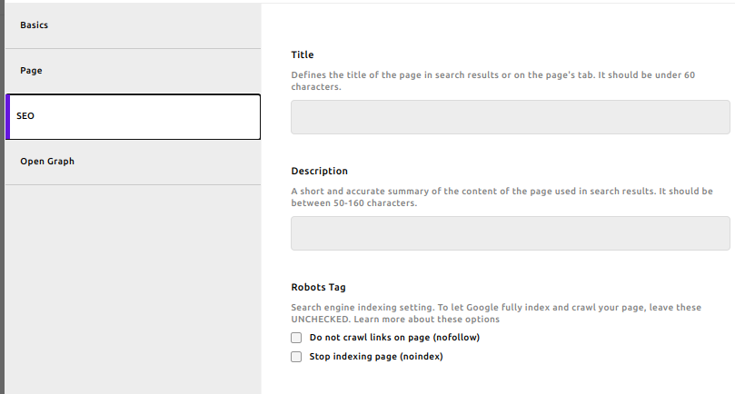
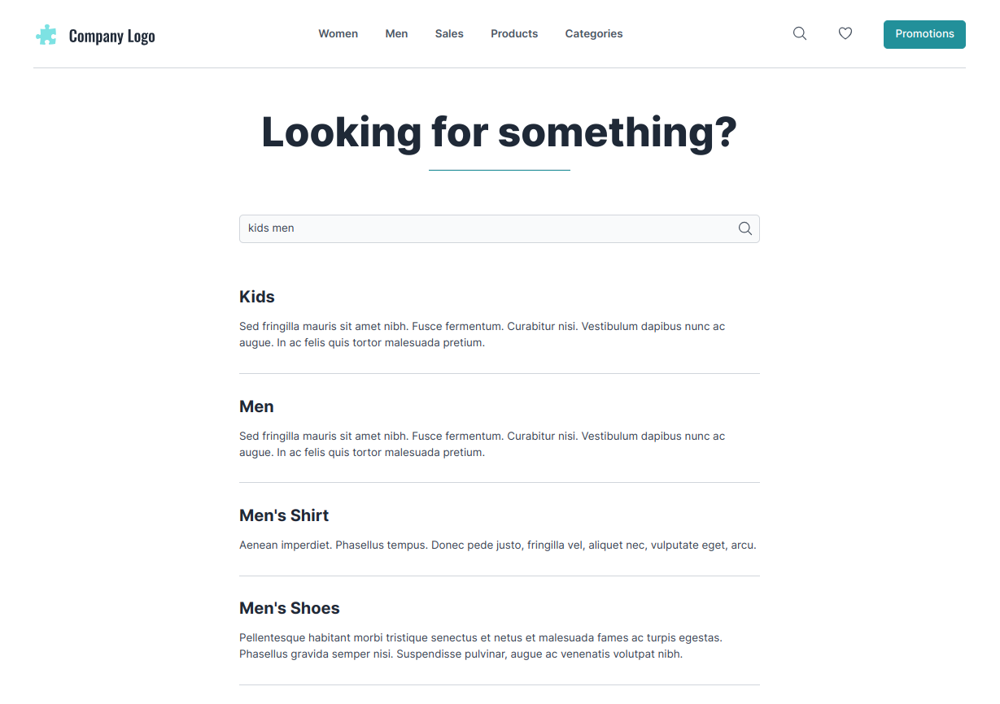

# {{ $frontmatter.title }}

The Apostrophe CMS E-commerce Starter Kit comes with a set of features, that will help you build both search engine optimized and social sharing friendly website. Furthermore, it offers a simple but powerful in-site search functionality.

## SEO and Open Graph

Every page and piece, that is visible and have its own URL on your website, has dedicated to SEO and Open Graph (helping the shared content from your website to social platforms to be well offered). You can find them in the respective "SEO" and "Open Graph" tabs of the Editor Modal.

## Search

If you want to show the Apostrophe CMS core search feature (button) in the header of your site, you need to set it from the site configuration - in the "Search URL" field set choose "Page" type, and select the "Search" page from the relation field or modal.

::: info
In order to have well looking search results, you need to have filled either the "SEO - Description" field of every piece/page or the "Tagline" field. The search page results will use one or the other, where the first in the order mentioned above will be shown.
:::

