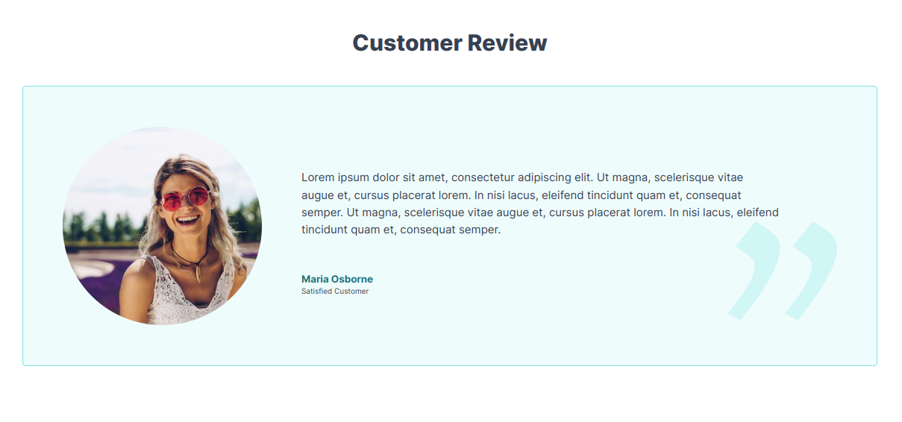

# {{ $frontmatter.title }}

The Apostrophe CMS E-commerce Starter Kit comes with a set of widgets, that can be used to build your site content. Almost every page type offers at least one area with predefined, appropriate for the given context list of widgets. Developers can easily add new widgets, or modify the existing ones.

## Hero Widgets

It's available in dedicated "header" areas on Home page, Product Category page and Custom Pages. Furthermore, it comes in two variants - image aside and full-width background image. Both variants have a wide range of customization options.

### Full Width Background Image

You can choose between dark/light background filters, add a background image, arrange title and tagline via embed rich text widget and even highlight a title word in a brand color. When doing the latter, watch out for the contrast between the background image and the title word. You can find the respective custom styles in the rich text editor (alongside the Heading and Paragraph styles):
- **Color Brand Light** - appropriate when widget option "Dark" is enabled
- **Color Brand Dark** - appropriate when widget option "Dark" is off (light background)

### Image Aside

You get a similar experience with this variant, but instead "Dark" option, you'll be able to choose an "Image Position" (left or right). 

### Call to Action buttons

You can also add primary and/or secondary Call to Action (CTA) buttons. If you choose to do so, you can choose the URL source type:
- **Page** - choose a page from the relation field or modal.
- **Product Category** - choose a product category from the relation field or modal.
- **File** - choose a file from the relation field or modal.
- **URL** - enter any valid URL in the text field.

::: tip
The same experience is available in the [Call to Action](#call-to-action-widget) and [Promo](#promo-widget) widgets as well.
:::

## Call To Action Widget

The call to action widget is available on Home page, single Product Category and Product page and Custom Pages. It's a great way to highlight a product category or a product, or emphasize a link to any page on your site. It supports CTA buttons in the same way as [described here](#call-to-action-buttons).

You can choose between three variants.

### Dark Background Color

### Light Background Color

### Image Background

## Promo Widget

The promo widget is available on Home page, single Product Category and Product page and Custom Pages. It's a great way to promote any content, including product landing pages. It supports CTA buttons in the same way as [described here](#call-to-action-buttons).

You can set the image position among the other [standard options](#hero-widgets) described in the above sections.

### Image left

### Image right

## Product Widget

An extremely flexible in terms of filtering/choosing content widget. It allows automated resolution of any number of products based on tag, recent date or category. It also has a manual mode where you can manually pick a product.

You can choose between standard and condensed view, where the former shows products in the exactly same way as it's done on the product list page, while the latter shows more products per line (device optimized) and is more appropriate in the context of e.g. "related products".

### Standard view

### Condensed view

## Featured Product Widget

Same as the [Product Widget](#product-widget), but filters the `recent` result by the `featured` product flag and uses a `masonry` product card list.

## Product Category Widget

Used to promote Product Categories - recent or manually chosen. 

## Blockquote widget

A simple widget for promoting Custom Reviews.

## Content Widget

The Content Widget acts as a container for the core widgets Rich Text, Image and Video widgets. This is needed because of design and accessibility reasons. The content widget takes care of the horizontal constraints (human readable screen width) and vertical spacing of the underlying core widgets.

### Content - Rich text in-page editing

### Content - Image in-page editing

